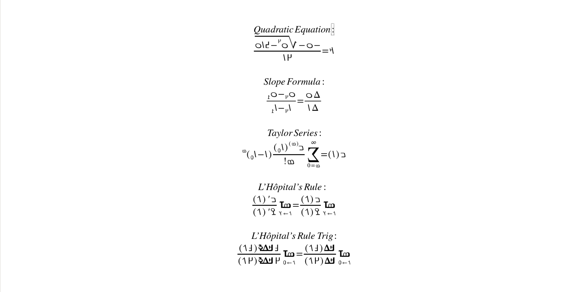
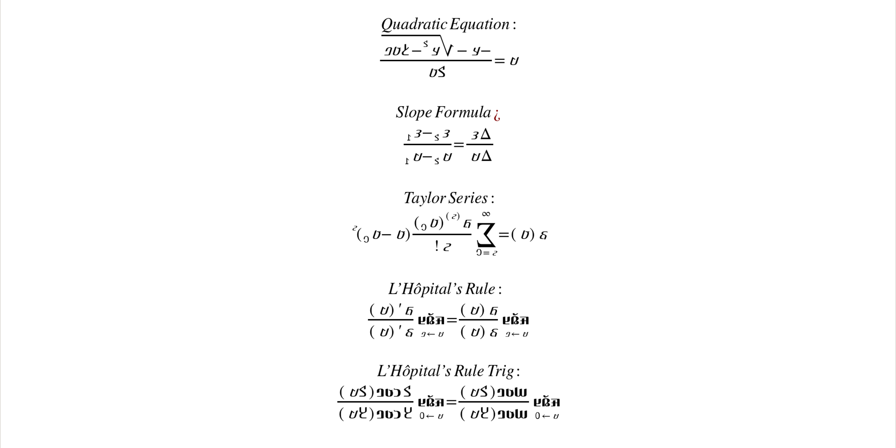

# XITS

[![][Fontspector]](https://JamraPatel.github.io/XITS-Math.git/fontspector/fontspector-report.html)
[![][OpenType]](https://JamraPatel.github.io/XITS-Math.git/fontspector/fontspector-report.html)
[![][Universal]](https://JamraPatel.github.io/XITS-Math.git/fontspector/fontspector-report.html)
[![][Google Fonts]](https://JamraPatel.github.io/XITS-Math.git/fontspector/fontspector-report.html)
[![][Glyphset]](https://JamraPatel.github.io/XITS-Math.git/fontspector/fontspector-report.html)

[Fontspector]: https://img.shields.io/endpoint?url=https%3A%2F%2FJamraPatel.github.io%2FXITS-Math.git%2Fbadges%2FFontspectorQA.json
[OpenType]: https://img.shields.io/endpoint?url=https%3A%2F%2FJamraPatel.github.io%2FXITS-Math.git%2Fbadges%2FOpentypeSpecificationChecks.json
[Universal]: https://img.shields.io/endpoint?url=https%3A%2F%2FJamraPatel.github.io%2FXITS-Math.git%2Fbadges%2FUniversalProfileChecks.json
[Google Fonts]: https://img.shields.io/endpoint?url=https%3A%2F%2FJamraPatel.github.io%2FXITS-Math.git%2Fbadges%2FFontFileChecks.json
[Outline Correctness]: https://img.shields.io/endpoint?url=https%3A%2F%2FJamraPatel.github.io%2FXITS-Math.git%2Fbadges%2FOutlineCorrectnessChecks.json
[Glyphset]: https://img.shields.io/endpoint?url=https%3A%2F%2FJamraPatel.github.io%2FXITS-Math.git%2Fbadges%2FGlyphsetChecks.json

XITS is an OpenType implementation of STIX fonts with multi-script math support. 

XITS is a Times-like typeface for mathematical and scientific publishing, based on STIX fonts. The main mission of XITS is to provide a version of STIX fonts enhanced with the OpenType MATH table, making it suitable for high quality mathematic typesetting with OpenType math-capable layout systems, like Microsoft Office 2007+, LibreOffice Math, XeTeX and LuaTeX.
The orginal repository can be found archived at https://github.com/aliftype/xits.

XITS Math Extended expands on the Arabic support included in 2014 to support other RTL writing systems, most notably Adlam and N'ko. Sources have been migrated from `SFD` to `UFO` format to provide more options for editing.

## Basic Usage

XITS Adlam and N'ko additions were made in conjuction with an update to LibreOffice Math that makes common mathematical functions in both scripts available. Below are reccomended font choices for typesetting formulas in each script in LibreOffice Math. For more comprehensive information regarding see [Adlam_Usage_LO.pdf](documentation/Adlam_Usage_LO.pdf) and [Nko_Usage_LO.pdf](documentation/Nko_Usage_LO.pdf) in the documentation folder.

### Adlam
Math - XITS Math Ext Regular
Variable - XITS Math Ext Italic
Functions - XITS Math Ext Regular
Numbers - XITS Math Ext Regular 
Text - XITS Math Ext Regular

### N'ko
Math - XITS Math Ext Regular
Variable - XITS Math Ext Unjoined Italic
Functions - XITS Math Ext Bold
Numbers - XITS Math Ext Regular 
Text - XITS Math Ext Regular

## About

JamraPatel is a design studio focused on developing fonts and utilities for underserved writing systems. Initial funding for this project was provided by the Stanford SILICON Dr. Chan Yeh Practioner Program.

## Building

Fonts are built automatically by GitHub Actions - take a look in the "Actions" tab for the latest build.

If you want to build fonts manually on your own computer:

- `make build` will produce font files.
- `make test` will run [FontBakery](https://github.com/googlefonts/fontbakery)'s quality assurance tests.
- `make proof` will generate HTML proof files.

The proof files and QA tests are also available automatically via GitHub Actions - look at https://JamraPatel.github.io/XITS-Math-Extended.git.

## Changelog

**20 April 2026. Version 1.40**

- MAJOR Added character sets to support Adlam and N'ko math and chemistry typesetting.

Changes prior to Version 1.40 can be found at https://github.com/aliftype/xits/blob/master/FONTLOG.txt

## License

This Font Software is licensed under the SIL Open Font License, Version 1.1.
This license is available with a FAQ at https://openfontlicense.org

## Repository Layout

This font repository structure is inspired by [Unified Font Repository v0.3](https://github.com/unified-font-repository/Unified-Font-Repository), modified for the Google Fonts workflow.
